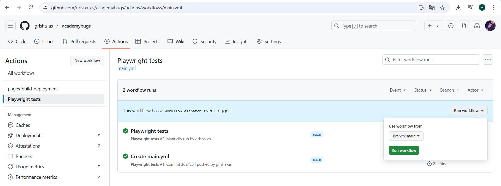
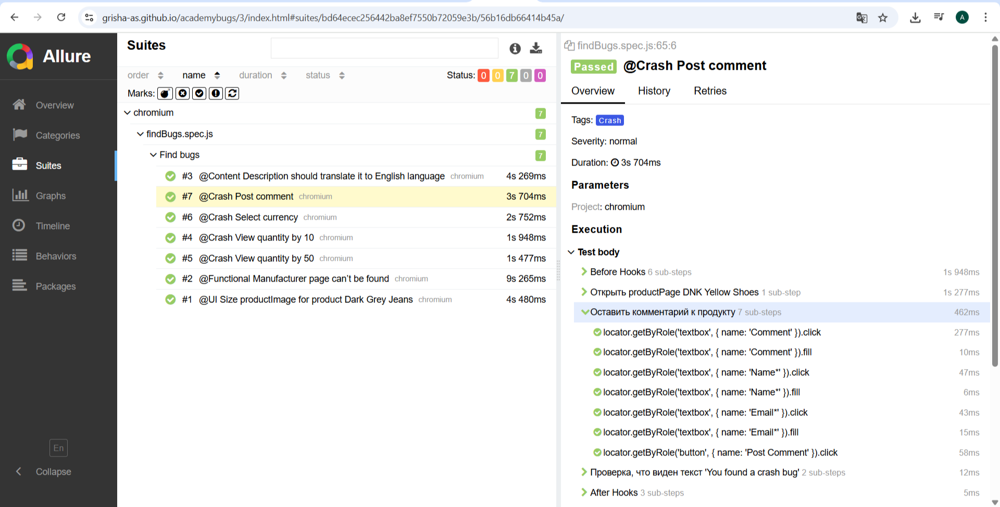

## Репозиторий для проекта e2e тестов сервиса AcademyBugs.com
---
## Содержание
- [Описание](#Описание)
- [Стек](#Стек)
- [Тестовый набор Find bugs](#Тестовый-набор-Find-bugs)
- [Запуск тестов и генерация отчета](#Запуск-тестов-и-генерация-отчета)
- [Запуск workflow в GitHub Actions](#Запуск-workflow-в-Github-Actions)
- [Пример Allure отчета](#Пример-Allure-отчета)


---
## Описание
Репозиторий содержит набор e2e тестов для поиска багов на сайте https://academybugs.com/find-bugs/.

Тестовый набор проверяет факт нахождения дефекта (получение сообщения о найденной ошибке).

---


## Стек


Тесты для проекта написаны с использованием JS + Playwright, для CI/CD используется Github Actions, генерация отчетов в Allure.

---
## Тестовый набор Find bugs

- [x] Size productImage for product Dark Grey Jeans (Размер карточки товара Dark Grey Jeans не соответствует стандартному)
- [x] Manufacturer page can’t be found (Не найдена страница при переходе по ссылке Manufacturer)
- [x] Description should translate it to English language (Описание продукта должно быть на английском языке)
- [x] View quantity by 10 (Установить количество отображаемых товаров на странице: 10)
- [x] View quantity by 50 (Установить количество отображаемых товаров на странице: 50)
- [x] Select currency (Выбрать валюту для отображения цен)
- [x] Post comment (Оставить комментарий к товару)

---
## Запуск тестов и генерация отчета

Команда для локального запуска тестов

```
npm run test
```
Команда для локального запуска в режиме ui

```
npm run testui
```

Команда для локального формирования отчета

```
npm run report
npm run reportOpen
```
---
## Запуск [workflow в GitHub Actions](https://github.com/grisha-as/academybugs/actions/workflows/main.yml)

Workflow настроен на ручной запуск через Github Actions. Для этого нужно перейти в раздел Actions в репозитории, выбрать workflow "Playwright tests" и нажать "Run workflow".



---
## Пример [Allure отчета](https://grisha-as.github.io/academybugs/)


