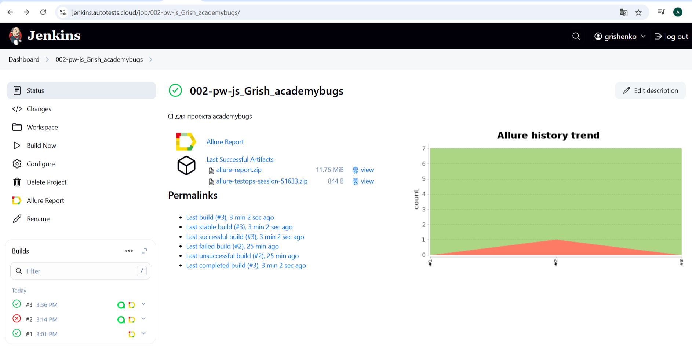
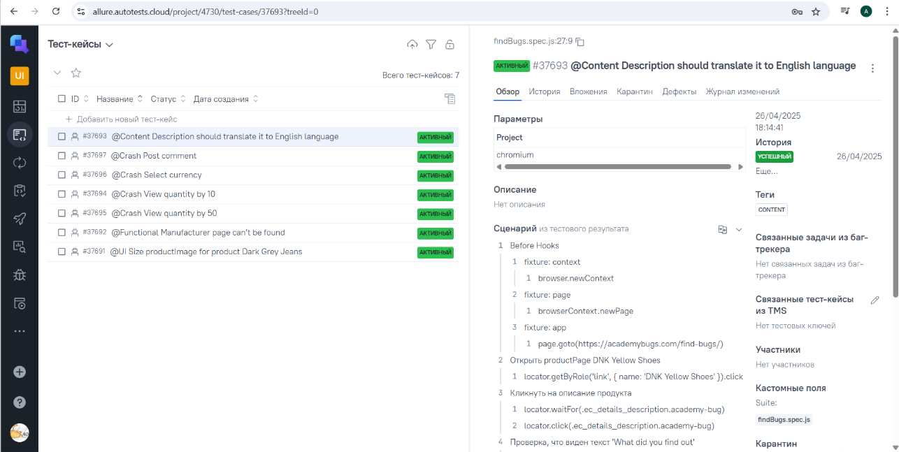
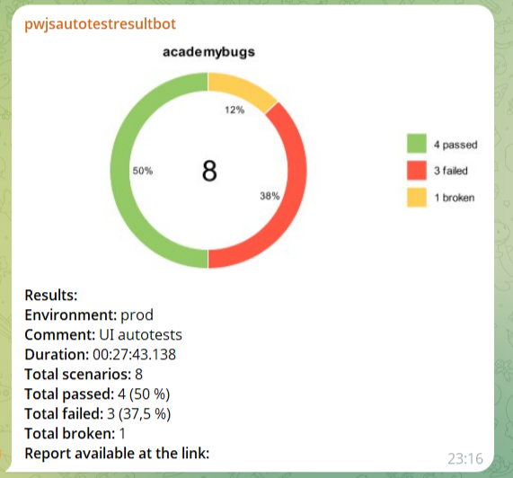

## Часть I Дипломной работы по итогам прохождения курса 
## [QA.GURU | Автоматизация тестирования JS + Playwright](https://qa.guru/playwright_js)

## Репозиторий для проекта UI автотестов сервиса AcademyBugs.com
---
## Содержание
- [Описание](#Описание)
- [Стек](#Стек)
- [Тестовый набор Find bugs](#Тестовый-набор-Find-bugs)
- [Запуск тестов и генерация отчета](#Запуск-тестов-и-генерация-отчета)
- [Запуск workflow в GitHub Actions](#Запуск-workflow-в-Github-Actions)
- [Пример Allure отчета](#Пример-Allure-отчета)
- [Запуск в Jenkins](#Запуск-в-Jenkins)
- [Интеграция с AllureTestOps](#Интеграция-с-AllureTestOps)
- [Уведомление в Telegram](#Уведомление-в-Telegram)


---
## Описание
Репозиторий содержит набор UI тестов для поиска багов на сайте https://academybugs.com/find-bugs/.

Тестовый набор проверяет факт нахождения дефекта (получение сообщения о найденной ошибке).

---


## Стек

  
  
  
  


Автотесты для проекта написаны с использованием JS + Playwright, для CI/CD используется Github Actions и Jenkins, генерация отчетов в Allure, реализована интеграция с тест-менеджмент системой AllureTestOps и отправка уведомлений о статусе выполнения тестов в Telegram.

---
## Тестовый набор Find bugs

- [x] Size productImage for product Dark Grey Jeans (Размер карточки товара Dark Grey Jeans не соответствует стандартному)
- [x] Manufacturer page can’t be found (Не найдена страница при переходе по ссылке Manufacturer)
- [x] Description should translate it to English language (Описание продукта должно быть на английском языке)
- [x] View quantity by 10 (Установить количество отображаемых товаров на странице: 10)
- [x] View quantity by 50 (Установить количество отображаемых товаров на странице: 50)
- [x] Select currency (Выбрать валюту для отображения цен)
- [x] Post comment (Оставить комментарий к товару)

---
## Запуск тестов и генерация отчета

Команда для локального запуска тестов

```
npm run test
```
Команда для локального запуска в режиме ui

```
npm run testui
```

Команда для локального формирования отчета

```
npm run report
npm run reportOpen
```
---
## Запуск [workflow в GitHub Actions](https://github.com/grisha-as/academybugs/actions/workflows/main.yml)

Workflow настроен на ручной запуск через Github Actions. Для этого нужно перейти в раздел Actions в репозитории, выбрать workflow <code>Playwright tests</code> и нажать <code>Run workflow</code>.


---
## Пример [Allure отчета](https://grisha-as.github.io/academybugs/)


---
## Запуск в [Jenkins](https://jenkins.autotests.cloud/job/002-pw-js_Grish_academybugs/)

Для запуска выполнения тестов необходимо авторизоваться на сайте [Jenkins](https://jenkins.autotests.cloud/login?from=%2F), перейти в нужную [джобу](https://jenkins.autotests.cloud/job/002-pw-js_Grish_academybugs/) и нажать <code>Build Now</code>. 
После завершения паплайна будет сформирован Allure-отчет, результаты выполнения будут отправлены в AllureTestOps и в Telegram. 



---
## Интеграция с [AllureTestOps](https://allure.autotests.cloud/project/4730/dashboards)



---
## Уведомление в Telegram

После завершения выполнения тестов бот, созданный в Telegram, автоматически обрабатывает данные и отправляет сообщение с отчетом о результате тестирования в чат.

